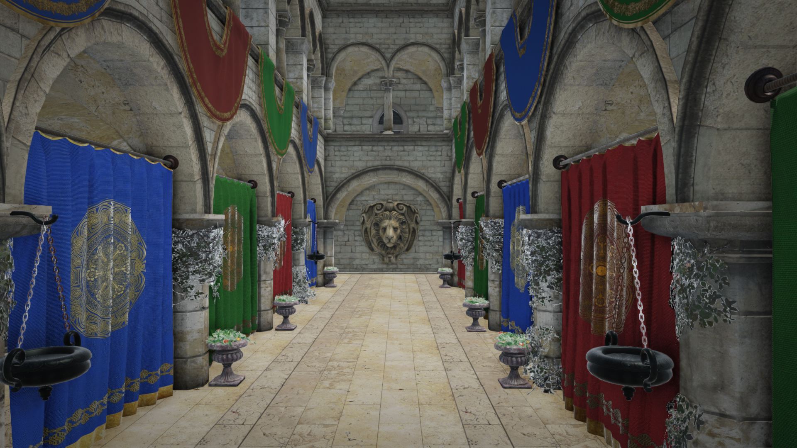

# Sponza in Balaur

The scene every renderer is compared against, imported into
[Balaur](https://balaurengine.org), lit by its own sky, and walked through in
first person.

Nothing here was authored by hand except a camera, a sun, an environment and a
player. One `balaur import` did the rest.

https://github.com/balaurengine/balaur-sponza/assets/sponza_walk.mp4

## Running it

    python3 scripts/fetch.py                          # 50 MB, beside this repo
    balaur import ../sponza-source/Sponza.gltf --project .  # 25 materials
    python3 scripts/stage.py                     # the staging over the import
    balaur run .

**W A S D** walks, the mouse looks, **space** jumps. `scripts/media.sh` writes
the still and the clip without a window.

## What the import kept

`balaur import` reads the file and writes a scene beside it. Of each of
Sponza's 25 materials it keeps:

- **Every factor and map.** Base colour, metallic, roughness, emissive, the
  normal and occlusion maps, the alpha mode and its cutoff, the index of
  refraction and the volume. Each becomes a `material` asset over one stock
  shader, `shaders/imported.wesl`.
- **The sampler.** glTF wraps and mip-maps by default; Balaur clamps and does
  not. A sidecar per image carries the file's own settings, without which the
  floor — whose coordinates run past one — clamps to a single texel and draws
  flat. It also says which maps are colour: a roughness read back through the
  sRGB curve is not the number the file stored, and a scene of mirrors is what
  a glancing sky then makes of it.
- **One mesh node per material,** so each surface draws with its own. The
  mesh asset names a `part`, and the parser keeps only that material's
  triangles out of the 103 primitives.

Nothing is tuned over it. The staging names a camera, a sun, a sky, a probe
and a player, and every number those carry is the engine's own except
`shadow_distance`, which is in world units and this arcade is thirty of them
long.

`scenes/sponza.toml` is that output, committed so it can be read without
running anything. `scripts/stage.py` writes `scenes/main.toml` from it plus
the staging below, so re-importing never loses the staging and the staging
never has to know about 25 materials.

## What the picture shows

- **Image-based lighting.** The sky lights the whole atrium; there is one
  directional light for the sun and nothing else. It replaces the flat
  ambient rather than adding to it.
- **Screen-space occlusion**, in the creases where the columns meet the floor
  and under the plinths, at the pass's own defaults.
- **A reflection probe** over the court, so the marble reflects the arcade
  around it rather than the sky above the building.
- **The finishing passes** on `camera.post`: bloom, a vignette, and FXAA,
  drawn in the order the list gives.

## The player, and what it collides with

    [nodes.collider3d]
    kind = "trimesh"
    mesh = "#sponza_shell"
    fix_internal_edges = true

That is the whole collider: the model's own triangles, no body, so it is
static geometry. `fix_internal_edges` smooths the seams between them, without
which a character catches on flat ground.

The player is the editor library's own first-person rig — a capsule, a
`character3d`, and a camera on one node — dropped in and pointed down the
arcade. It falls to the floor, stays grounded, slides along walls and steps up
the kerbs.

## What it costs

The scene as the renderer walks it, from `render.stats()`:

| | |
| --- | --- |
| draw calls | 25, one per material |
| triangles a frame | 262,267 |
| collider triangles | the same 262,267, as one static trimesh |
| materials | 25, over one shader |
| images | 69, 41 MB at the file's own sizes |

`balaur run . --timings` prints what each stage of a frame cost. On a quiet
machine that is the number to quote; it is GPU-bound, and the post chain is
where most of it goes.

## Licence

The model is
[Sponza](https://github.com/KhronosGroup/glTF-Sample-Assets/tree/main/Models/Sponza)
from the Khronos glTF sample assets, CC BY 4.0, after the original by Frank
Meinl for Crytek. It is fetched rather than committed, and nothing here is
derived from it. Everything else in this repository is [MIT](LICENSE).
